## Hi 👋

I am **fFlorian**, embedded engineer/ maker. Interested in:
- developing embedded devices
- low level programming
- 3D printing
- electronics and PCB design.
- cool sensors
- unusual usecases for tech

arent we all...

| this (hopefully) | github | grabcad |
|------|--------|---------|
|[fflori4n.com](fflori4n.com)|[github.com/fflori4n](https://github.com/fflori4n)| [grabcad.com/florian.f-4](https://grabcad.com/florian.f-4)|

Languages and Tools:

 

 
 
 

 

# A list of some *COOL* projects I worked on:
 

## **nod3-comfirm** - *common firmware for ESP32 based devices*
###### `C++20`, `ESP_IDF`, `ESP32_C3`
Written using ESP_IDF and modern(ish) C++,nod3-comfirm aims to be used as a basic firmware for all my smart sensor devices. Firmware has basic functions that are needed for every IoT thing, like:
- Network management (WLAN)
- IO Control
- ADC continous/ DMA and other ADC functions
- Time keeping, NTP and RTC functions
- Websocket communication with Homeassistant custom component
- libraries for common sensors using I2C

https://github.com/fflori4n/nod3-comfirm

  

## IoT wind and rain sensors
##### `#ESP-Arduino`, `websockets`, `ESP32_S3`
The classic maker project of a 'wheather station' basically. Measuring wind speed, wind angle and rainfall. The sensors are fully 3D printed. Sensor connects to Homeassistant via websocket and custom component, this was written in Arduino framework using ESP32-S3, the sensors are now also supported in nod3-confirm, so the next version will be battery/solar + ESP C3.

  

## **OPEN hand** - *hand partial prosthetic*
##### `mechanical design`, `motor positioning`, `robotics`
Working in a team of four engineers to build a prototype 3D printed partial hand prosthesis. To prove that a prosthesis does not have to cost a lot of money to be actually useful, and can easily be built using tech available to makers. Read more about the goals and challenges on the project's github page: https://github.com/AleksaHeler/OpenHand

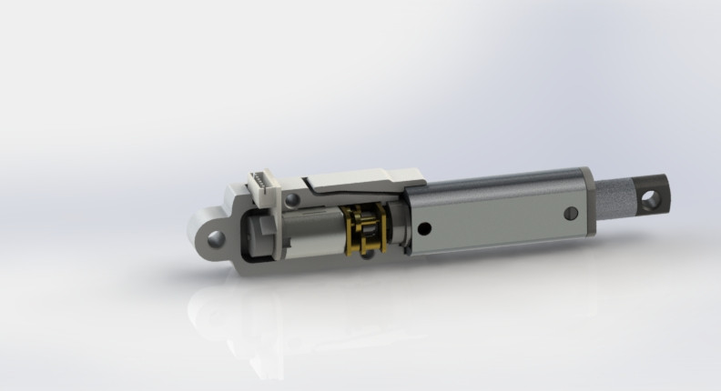
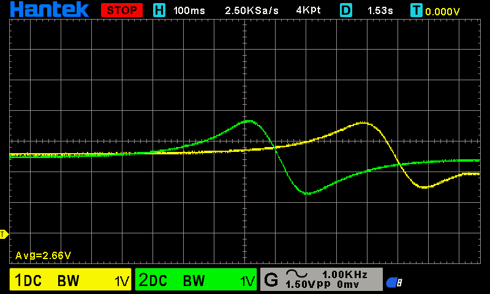
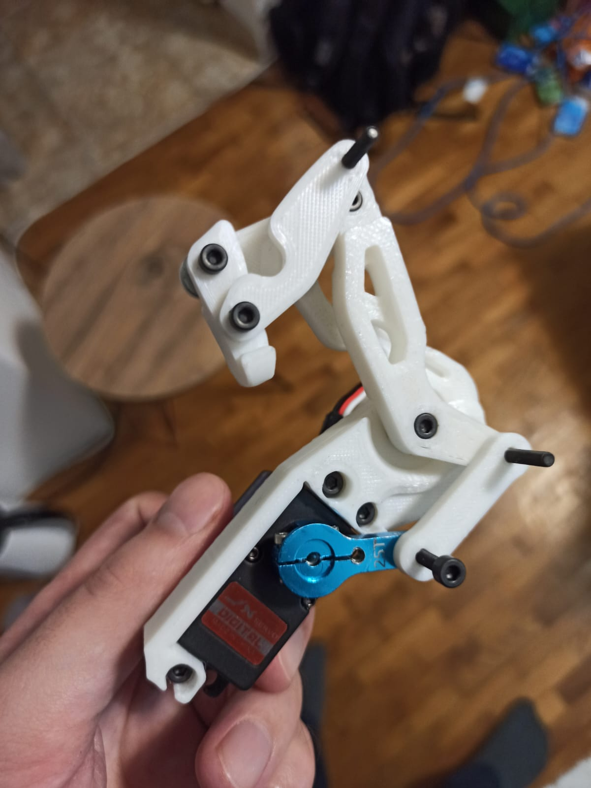

  

## **Smart Hive** - *Smart sensor system for monitoring bee hives - MSC final project*
##### `SIM7000G`, `RS485`, `MQTT`, `solar power`, `ESP32_Wroom_32_u`, `Atmega168`, `Atmega328`
Embedded (Arduino based) sensors for measuring temperature, humidity, ambient light and hive weight. These values are mesured, forwarded to a Gateway device over RS485. Gateway device aggregates data from sensors and forwards it to the smart hive server via an LTE/4G mobile modem.

https://github.com/fflori4n/smartHive

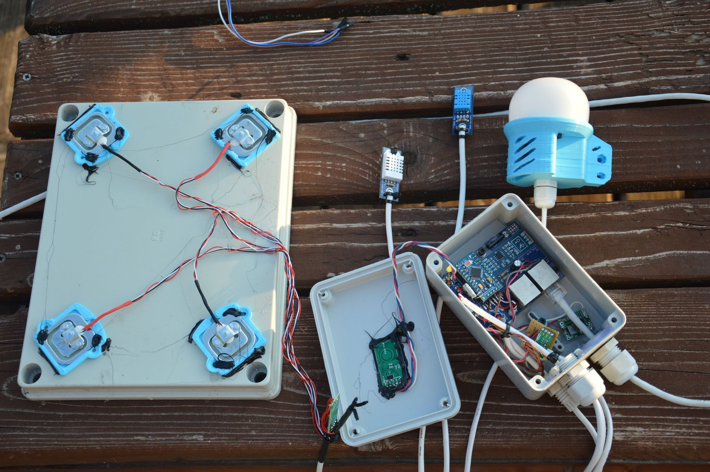
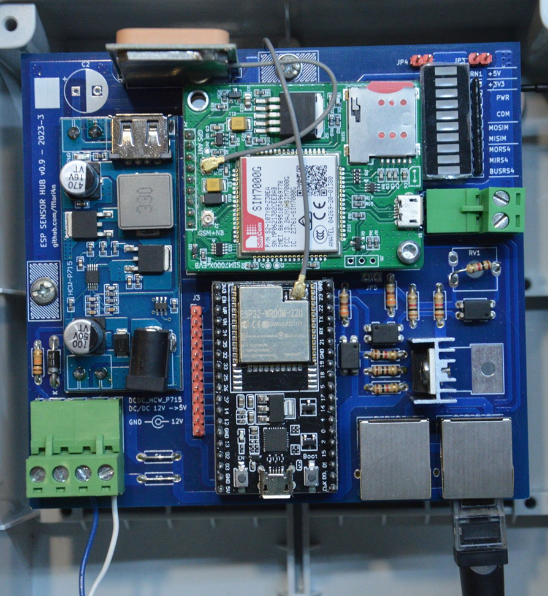
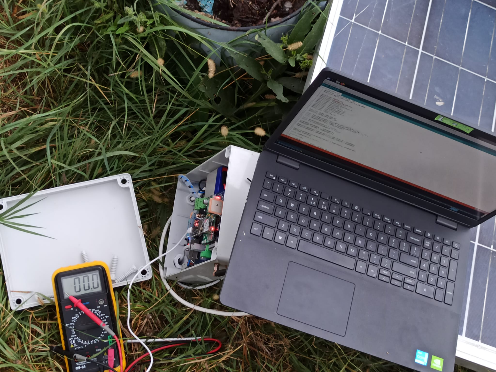

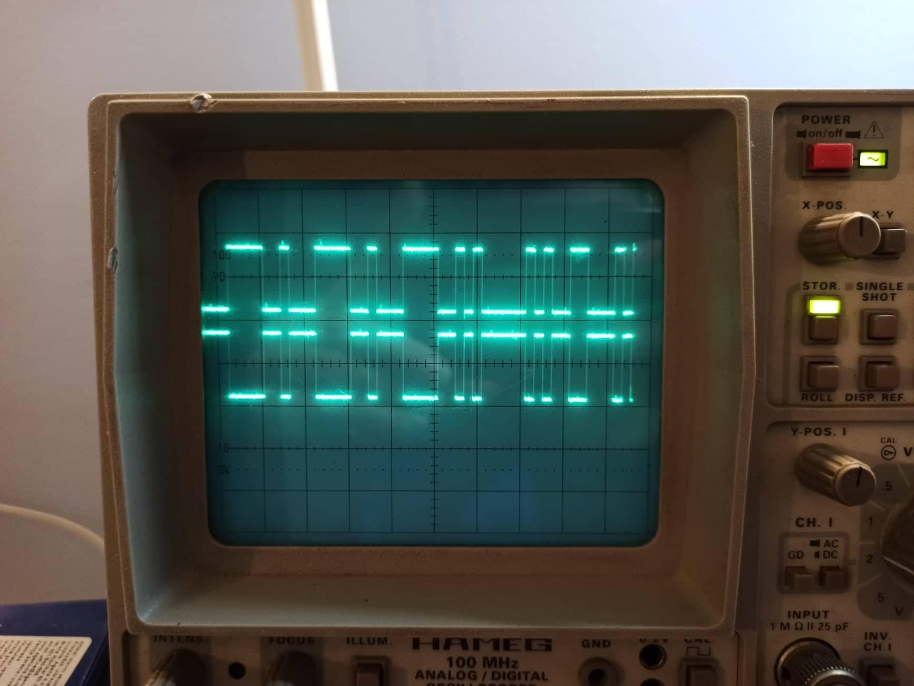

  

## **Image processing for agricultural drone** 
##### `C++14`, `python`, `RPI4`
R&D project in collaboration with Drontech ([Drontech Facebook page](https://www.facebook.com/dronteh)) to develop a proof of concept for a device that uses computer vision to estimate plant mass beneath a drone. The system runs on a Raspberry Pi 4 using OpenCV for real-time frame processing. Due to limited processing power, the frame rate is relatively low (around 15 FPS).

 A GPIO pin is set to HIGH when plant mass exceeds a defined threshold. For testing purposes, a green LED was connected to this output. Ultimately, the signal is intended to control sprayer valves, turning off pesticide flow when the area under the flight path lacks viable cultivation or the plants have dried out, avoiding unnecessary pesticide use on unproductive areas.

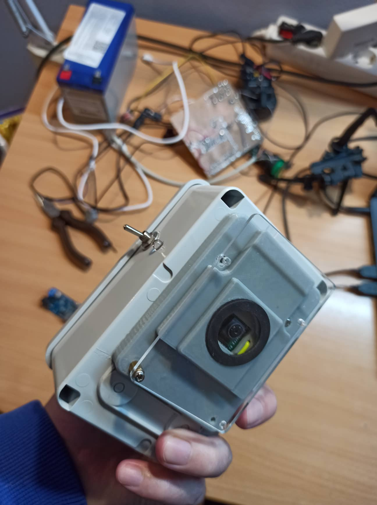
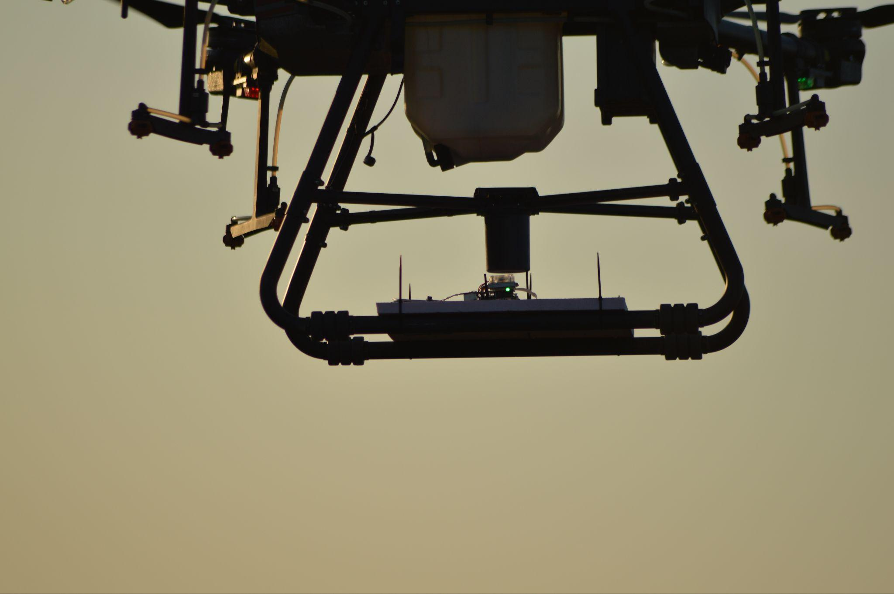

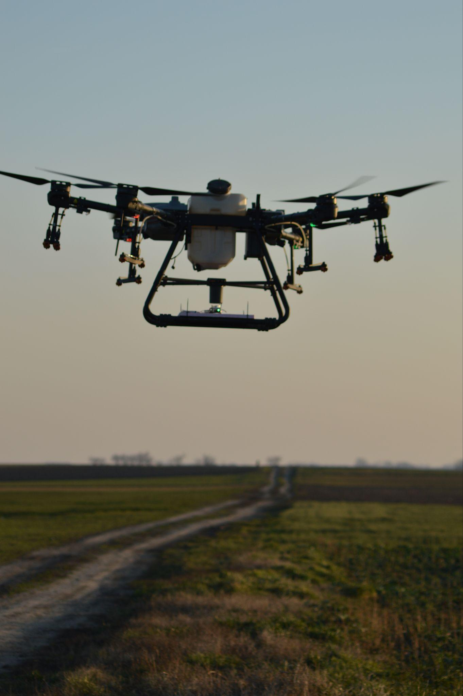

*yes, rpi is fixed to the drone using zip ties, and getting absolutely blasted by ground obstacle radar*

  

## **Liquid level sensing based on capacitance** 
##### `ESP web-user interface`, `analogue sensor design`, `KiCAD`
This project is more interesting than it is practical. It uses the capacitance of a partially submerged, isolated wire to estimate the liquid level inside a water reservoir. While not very precise (±20 mm on a 1400 mm probe if perfectly calibrated), it is a very inexpensive solution that definitely works to a degree. Combine it with an ESP32 and a smartphone, and you have a reservoir level sensor with a web-based readout.

The project repo:
https://github.com/fflori4n/ESP_tankLevelSensor

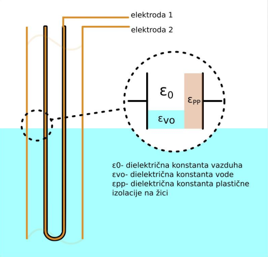

  

## **3D design and printing**
##### `3d-printing`, `FDM`, `CAD`, `CNC`

3D printing is a great hobby, it allows you to create very complex parts quickly and at a low cost. I have three printers: one MSLA and two FDMs. I mostly use the FDM printers because resin printing is messy, toxic, and relatively expensive for making parts. My main use case is printing technical components. It's also a lot of fun to tinker with the printers, upgrading both the software and hardware to improve print speed or quality.

Honorable mention: A DIY CNC router I built way back, and it has it's own instructable: https://www.instructables.com/CNC-Router-4/

grabCAD page with some models that are shared for free:
https://grabcad.com/florian.f-4/models

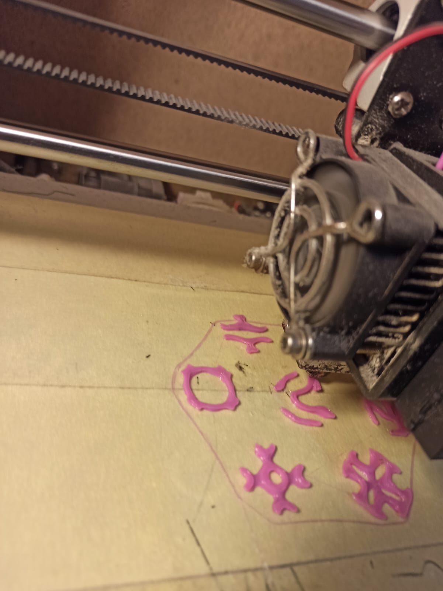
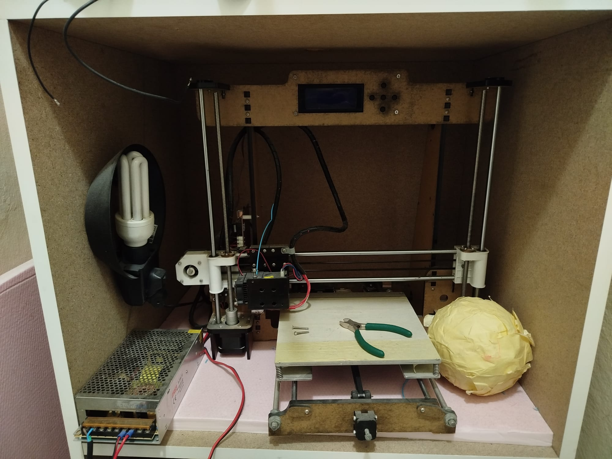

Also at some point, my coffee table was a 3D printer box with 3D printed legs, so that has to count for something I think:

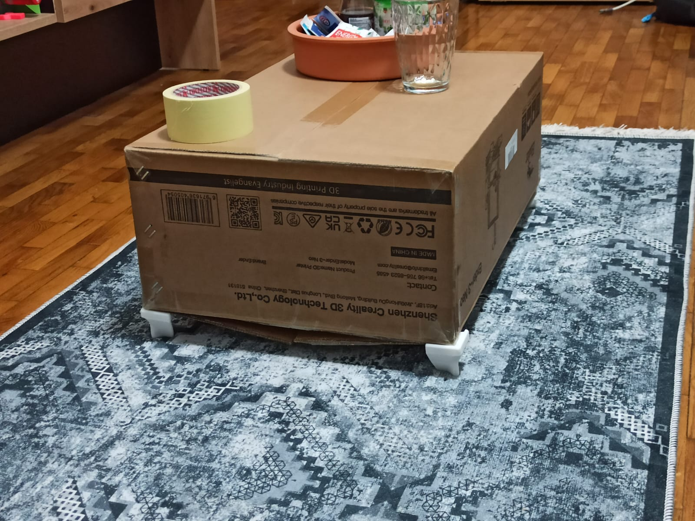

